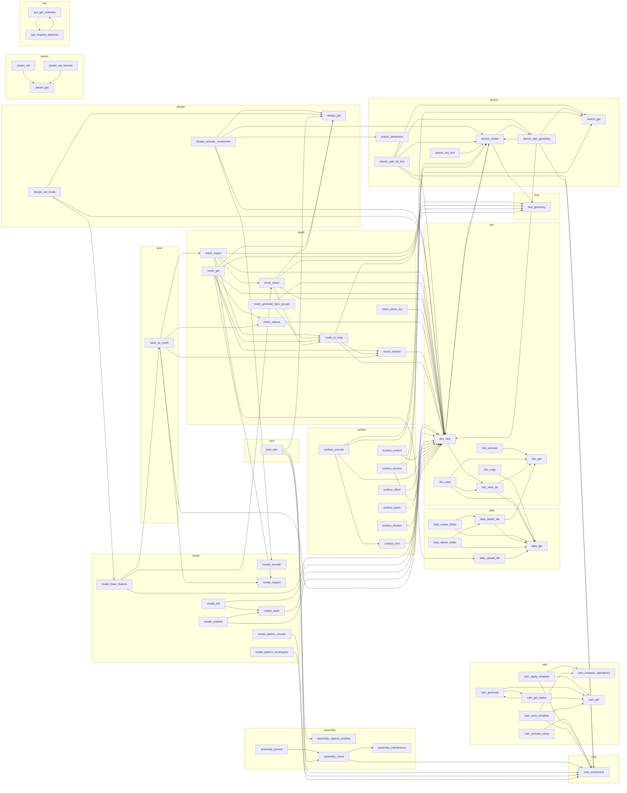

# Tool wiring (generated)

_Auto-generated from the tool source by `tests/gen_wiring.py`. Do not edit by hand._ The
breadcrumb map: where each tool's agent-facing text (its **description** = the manual, and its
runtime **note/error** = the situational tip) names ANOTHER tool, steering the agent onward.
Use it to engineer the wiring: close orphans (a tool nothing leads to), fix dead references,
and factor duplicated guards into shared helpers.

**Tools:** 121  |  **description breadcrumbs:** 520  |  **note/error breadcrumbs:** 110
  |  **guidance smells flagged:** 0
## Blindspots to engineer

### Dead references (a tip names something that is not a tool - FIX THESE)
- none - every named breadcrumb resolves to a real tool.

### Orphans (no breadcrumb leads here - reachable only via workspace_orient / search)
**Read/Acquire (2)** - higher concern, a check-your-work tool nothing points to:
  `model_compute_holder`, `view_screenshot_multi`

**Edit (11)** - usually leaf actions, scan for genuine gaps:
  `cam_activate_setup`, `cam_edit_setup`, `cam_reorder`, `cam_set_nc_comment`, `cam_show_toolpath`, `doc_update_xref`, `mesh_combine`, `model_arrange`, `model_hole`, `sketch_set_text`, `sys_reload_addin`

### Duplicated guard strings (>=4 copies = factor into a shared _common helper)
- **27x** across 15 module(s): "No active design. Create or open a document first (see doc_new)."
- **14x** across 9 module(s): "No active design. Open or create a document first (see doc_new)."
- **7x** across 4 module(s): "No active design with components."
- **5x** across 4 module(s): "'. Use sketch_get or sketch_create."
- **4x** across 3 module(s): "'. Use: new, join, cut, intersect."
- **4x** across 2 module(s): "Could not create output directory '"

### Hubs (most breadcrumbs lead here - the connective tissue)
- `find_geometry`  <- 42  (desc 37, note 5)
- `doc_new`  <- 35  (desc 10, note 25)
- `view_screenshot`  <- 29  (desc 20, note 9)
- `sys_get_api_doc`  <- 27  (desc 27, note 0)
- `sketch_create`  <- 25  (desc 18, note 7)
- `cam_get`  <- 22  (desc 18, note 4)
- `data_get`  <- 22  (desc 15, note 7)
- `design_get`  <- 21  (desc 16, note 5)
- `model_extrude`  <- 19  (desc 18, note 1)
- `doc_get`  <- 13  (desc 9, note 4)
- `sketch_add_geometry`  <- 13  (desc 11, note 2)
- `data_upload_file`  <- 12  (desc 11, note 1)

## The guidance surface (every note the agent can be told)

Every runtime **note/warning** string a tool can return, per tool - the guidance we give,
in one place, to judge: is it there, consistent, teaching a REAL best-practice, or a stale
war story? Smells are auto-tagged: `war-story` (narrates history), `cause-guess` (asserts an
unverified cause), `hedge` (waffles). (Pure error-validation strings - 'must be a number' -
are omitted; this is the GUIDANCE layer, not input validation.)

### `assembly_capture_position`
- This design does not expose snapshots (capture position).
- Nothing to revert - there are no captured positions.
- Fusion declined to revert the latest captured position.
- Latest captured position discarded (back to the joint-defined state).
- has_pending = a moved-but-uncaptured position exists. Use capture to record it into the timeline, or revert to drop the latest capture.
- Nothing to capture - there is no pending position change. Move a jointed component first (its pose is transient until captured).
- Current position captured into the timeline.

### `assembly_constrain`
- No active design with components.
- Assembly constraint creation returned nothing.
- Components constrained with the relationship set (type inferred from geometry).
- 'relationships' must be a list of {snap_one, snap_two, flip?, offset?}.
- No relationships to constrain. Provide 'relationships' or snap_one/snap_two.
- Assembly constraint failed:
- ] needs both 'snap_one' and 'snap_two'.
- Provide 'relationships' or 'snap_one'/'snap_two' ('<occurrence>:<snap>') for autonomous geometry, OR select ONE entity on each occurrence in Fusion first then call again. (Got
- Could not read the two selected entities. Re-select and try again.
- ' is not a valid '<occurrence>:<snap>' (snap = center/top/bottom/left/right/front/back/cylinder/origin).
- ' is not a valid '<occurrence>:<snap>'.

### `assembly_ground`
- Specify 'ground_to_parent' (true/false). true locks the occurrence rigidly to its parent; false frees it to move/joint.
- No active design with components.
- ground_to_parent set (the stateless parent lock). true = locked rigidly to parent; false = freed to move/joint. To fix a part in space, keep it ground_to_parent=true and position it with assembly_m...
- Could not set ground_to_parent on '

### `assembly_move`
- Occurrence repositioned (free move, no joint). Pair with view_screenshot to view, and assembly_interference to check the new position doesn't clash with other parts.
- Occurrence posed (jointed - see jointed_warning). Pair with view_screenshot to view.
- '. Use mm, cm, or in.
- Provide a translation (dx/dy/dz), rotate_deg, or rotate_x/y/z - no movement specified.
- Use EITHER rotate_deg (single axis) OR rotate_x/y/z (multi-axis), not both.
- No active design with components.
- Could not read the edge's axis direction/point for rotate_axis.

### `assembly_rigid_group`
- No active design with components.
- A rigid group needs at least two occurrences.
- Rigid group creation returned nothing.
- Occurrences locked together as a rigid group.
- Could not create rigid group:

### `cam_activate_setup`
- Provide 'setup' - the name of the setup to activate.
- Setup activated and view fit. Use view_screenshot to capture it.
- Could not read setups:

### `cam_apply_template`
- Invalid library URL: '
- Could not resolve the '
- ' library root (it may not be configured/available).
- Could not read the template library:
- Provide 'setup' - the name of the setup to apply the template to.
- Provide 'template_url' or 'template_name'.
- ' is not in a valid state to apply.
- Operations were added to the setup. If generation_mode was 'skip', the toolpaths are not yet generated. Use cam_get(include=['operations']) or view_screenshot to verify, and cam_compare_operations ...
- Could not read setups:
- Invalid template URL: '
- No template found at URL:
- Failed to apply template:
- Provide 'template_name' for the new template.
- Provide 'setup' - the setup containing the operations.
- Provide 'operations' - a comma-separated list of operation names to bundle.
- Operations not found in '
- createFromOperations returned nothing.
- createFromOperations did not yield a usable CAMTemplate (got
- ). The operation set may not be templatable together, or this Fusion build's API returns an unexpected shape - please report.
- The created template is not in a valid state (the operation set may not be templatable together).
- importTemplate returned no URL (save may have failed).
- New template saved. Verify with cam_get(include=['templates']) (which reports each template's asset URL). This tool always creates a NEW template; overwriting an existing one is a separate capability.
- Could not read operations in '
- Could not build template from operations:
- Failed to save the template:
- Could not create destination folder '

### `cam_compare_operations`
- Provide both 'operation_a' and 'operation_b' (operation names).
- Operation not found: '

### `cam_edit_tools`
- Provide a valid 'tool' index (0..
- Provide 'parameters' {name: expression} to set on the tool.
- Tool has no parameter(s):
- . (Read the tool's parameters first.)
- Tool edited and persisted.

### `cam_generate`
- Generation launch returned no future (nothing to generate?).
- Generation is launched. Fusion advances it on the main-thread loop, which the POLL pumps - so call cam_get_status(handle) repeatedly until completed=true (each poll nudges it forward a bounded burs...
- Failed to launch generation for
- No setup/folder/operation named '
- '. Use cam_get(include=['operations']) to list names. Omit 'target' to generate the whole document.
- Pass skip_valid=false to force-regenerate it.

### `cam_get_status`
- cam_get(include=['operations']) for the per-op detail.
- No generations have been launched in this session. Call cam_generate first.
- No generation with handle '
- Further polling will NOT complete the errored items - fix them, then re-run cam_generate.
- Still generating - poll again. WARNING: nothing is actively generating yet out-of-date ops remain - they may be failing (broken input geometry / a mis-posed fixture or stock). cam_get(include=['ope...
- Still generating - poll again to advance it further.

### `cam_save_template`
- Invalid library URL: '
- Could not resolve the '
- ' library root (it may not be configured/available).
- Could not read the template library:
- Provide 'setup' - the name of the setup to apply the template to.
- Provide 'template_url' or 'template_name'.
- ' is not in a valid state to apply.
- Operations were added to the setup. If generation_mode was 'skip', the toolpaths are not yet generated. Use cam_get(include=['operations']) or view_screenshot to verify, and cam_compare_operations ...
- Could not read setups:
- Invalid template URL: '
- No template found at URL:
- Failed to apply template:
- Provide 'template_name' for the new template.
- Provide 'setup' - the setup containing the operations.
- Provide 'operations' - a comma-separated list of operation names to bundle.
- Operations not found in '
- createFromOperations returned nothing.
- createFromOperations did not yield a usable CAMTemplate (got
- ). The operation set may not be templatable together, or this Fusion build's API returns an unexpected shape - please report.
- The created template is not in a valid state (the operation set may not be templatable together).
- importTemplate returned no URL (save may have failed).
- New template saved. Verify with cam_get(include=['templates']) (which reports each template's asset URL). This tool always creates a NEW template; overwriting an existing one is a separate capability.
- Could not read operations in '
- Could not build template from operations:
- Failed to save the template:
- Could not create destination folder '

### `data_create_folder`
- Provide 'name' for the new project.
- ). Use a different name.
- Project creation returned nothing for '
- Failed to create project '
- Provide 'folder_name'.
- Provide 'project' (name) or 'project_id'.
- ' already exists at '
- Folder creation returned nothing for '
- Could not access project root folder:
- Could not prepare parent path '
- Failed to create folder '
- Could not read folder tree:
- Provide 'folder_id' (the id of the folder to delete; from data_get(include=['folders'])).
- Provide 'confirm_name' - the exact current name of the folder, as a safety confirmation. Get it from data_get(include=['folders']).
- No folder found for folder_id '
- '. It may already be deleted. Verify with data_get(include=['folders']).
- Refusing to delete a project ROOT folder.
- Name mismatch - refusing to delete. folder_id resolves to '
- ', but confirm_name was '
- '. Pass confirm_name='
- ' if you really mean this folder.
- Fusion declined to delete folder '
- '. No change was made.
- findFolderById failed for '
- ' is not empty (immediate files:
- ). Deleting it RECURSIVELY removes its ENTIRE subtree:
- subfolder(s) total - and bypasses the per-file reference-orphan check. Pass force=true AND recursive_confirm='
- ' to do this, or empty it first (data_delete_file for files).
- ' (a deliberate second acknowledgment). Nothing was deleted.
- RECURSIVE DELETE of '
- ' would remove its ENTIRE subtree:
- subfolder(s) - and bypasses the per-file reference-orphan check (nested referenced files would be orphaned). This is irreversible. To proceed, pass recursive_confirm='
- Delete failed for folder '

### `data_create_project`
- Provide 'name' for the new project.
- ). Use a different name.
- Project creation returned nothing for '
- Failed to create project '
- Provide 'folder_name'.
- Provide 'project' (name) or 'project_id'.
- ' already exists at '
- Folder creation returned nothing for '
- Could not access project root folder:
- Could not prepare parent path '
- Failed to create folder '

### `data_delete_file`
- Provide 'document_id' (the lineage URN of the file to delete).
- Provide 'confirm_name' - the exact current name of the file, as a safety confirmation. Get it from data_get or doc_get.
- No file found for document_id '
- '. It may already be deleted. Verify with data_get.
- Name mismatch - refusing to delete. document_id resolves to '
- ', but confirm_name was '
- '. Pass confirm_name='
- ' if you really mean this file.
- ' is currently OPEN - close it before deleting (Fusion will not delete an open document).
- . Deleting it would orphan those references. Pass force=true to delete anyway (Fusion may still reject it).
- Fusion declined to delete '
- ' (it may be referenced or open). No change was made.
- findFileById failed for '

### `data_delete_folder`
- Provide 'folder_name'.
- Provide 'project' (name) or 'project_id'.
- ' already exists at '
- Folder creation returned nothing for '
- Could not access project root folder:
- Could not prepare parent path '
- Failed to create folder '
- Could not read folder tree:
- Provide 'folder_id' (the id of the folder to delete; from data_get(include=['folders'])).
- Provide 'confirm_name' - the exact current name of the folder, as a safety confirmation. Get it from data_get(include=['folders']).
- No folder found for folder_id '
- '. It may already be deleted. Verify with data_get(include=['folders']).
- Refusing to delete a project ROOT folder.
- Name mismatch - refusing to delete. folder_id resolves to '
- ', but confirm_name was '
- '. Pass confirm_name='
- ' if you really mean this folder.
- Fusion declined to delete folder '
- '. No change was made.
- findFolderById failed for '
- ' is not empty (immediate files:
- ). Deleting it RECURSIVELY removes its ENTIRE subtree:
- subfolder(s) total - and bypasses the per-file reference-orphan check. Pass force=true AND recursive_confirm='
- ' to do this, or empty it first (data_delete_file for files).
- ' (a deliberate second acknowledgment). Nothing was deleted.
- RECURSIVE DELETE of '
- ' would remove its ENTIRE subtree:
- subfolder(s) - and bypasses the per-file reference-orphan check (nested referenced files would be orphaned). This is irreversible. To proceed, pass recursive_confirm='
- Delete failed for folder '

### `data_upload_file`
- Provide 'file_path' - the full path to a local CAD file.
- File not found on disk:
- Provide 'project' (name) or 'project_id' for the destination.
- Upload returned no future object.
- Upload is asynchronous and processes on the cloud (neutral formats like STEP are translated into a Fusion design). Use data_get on the destination project after a short wait to confirm the file app...
- Could not access project root folder:
- Upload failed to start for '
- Destination folder path not found: '
- '). Folders available at '
- . Pass create_path=true to create missing folders, or use data_get(include=['folders']) to see the structure.
- Could not prepare destination path '

### `design_activate_component`
- No active design. Create or open a document first (see doc_new).
- . Use design_get(include=['tree']) to list them.
- No occurrence/component matched '
- Occurrence.activate() returned false for '
- ' - could not make it the active edit target.
- This component is now the active edit target - sketch_create / model_extrude / sketch_dimension build into it. Activate 'root' (or '') to return to the root.
- Root component is the active edit target - new geometry builds at the root.

### `design_recompute`
- Full recompute done; downstream features rebuilt.

### `design_set_mode`
- No active design. Create or open a document first (see doc_new).
- Capability map is keyed by mode requirement; call design_set_mode to convert, or model_base_feature to open a base-feature scope.
- 'target' must be one of: parametric, direct (got '
- Converting to DIRECT destroys the timeline and all design history (irreversible). Re-call with confirm_history_loss=true to proceed.
- Re-run design_get(include=['mode']) to see the updated capability map.
- Assignment did not take - design is still

### `doc_activate`
- Switch ACCEPTED but not yet active - activation is async and hasn't propagated. Call doc_get to confirm it took before acting on the new document.
- Provide 'name' - the open document to activate.
- No open document matched '
- Activate failed for '

### `doc_close`
- No documents are open.
- . Fusion keeps at least one document open.
- discarding unsaved changes
- No open document matched '
- No active document to close.

### `doc_copy`
- The copy preserves external references: each referenced component still points at its ORIGINAL source file - the references are not re-copied. To save a copy that shares lineage for joint auto-repa...
- Provide 'document_id' (lineage URN, preferred) or 'name'.
- Provide 'project' (name) or 'project_id' for the destination.
- Destination project not found:
- ' already exists in '
- ). Copy into a different folder, or remove the existing copy first.
- Copy returned nothing for document '
- No file found for document_id '
- '. Pass the file's lineage id (URN) from data_get.
- When using 'name', also provide 'source_project' (name) or 'source_project_id' so the lookup is unambiguous.
- Source project not found:
- ' not found in source project '
- . Use data_get, or pass document_id (URN).
- Could not access destination project root:
- Copy failed for document '
- findFileById failed for '
- Destination folder path not found: '
- '). Folders at project root:
- . Pass create_path=true, or use data_get(include=['folders']) to see the structure.
- Could not prepare destination path '

### `doc_new`
- New blank design is now the active document (unsaved - it has no cloud id yet). Save it with doc_save_as, or start modelling with sketch_create.
- New-document creation returned nothing.
- Failed to create a new design document:

### `doc_save`
- Provide 'name' for the saved document.
- Provide 'project' (name) or 'project_id' for the destination.
- No active document to save. Open a document first.
- Destination project not found:
- Fusion declined to save '
- ' to the destination. No change made.
- Save is async on the cloud side. document_id is typically NULL right after saveAs (Fusion still holds a local handle, not the lineage URN yet). Confirm with doc_get after a short wait - the saved c...
- Could not access destination project root:
- Destination folder path not found: '
- '). Folders at project root:
- . Pass create_path=true, or use data_get(include=['folders']) to see the structure.
- Could not prepare destination path '
- No active document to save.
- The active document has never been saved (no cloud file yet). Use doc_save_as to give it a name and folder first.
- Active document saved as a new cloud version (description tagged as AI-agent).

### `doc_save_as`
- Provide 'name' for the saved document.
- Provide 'project' (name) or 'project_id' for the destination.
- No active document to save. Open a document first.
- Destination project not found:
- Fusion declined to save '
- ' to the destination. No change made.
- Save is async on the cloud side. document_id is typically NULL right after saveAs (Fusion still holds a local handle, not the lineage URN yet). Confirm with doc_get after a short wait - the saved c...
- Could not access destination project root:
- Destination folder path not found: '
- '). Folders at project root:
- . Pass create_path=true, or use data_get(include=['folders']) to see the structure.
- Could not prepare destination path '
- No active document to save.
- The active document has never been saved (no cloud file yet). Use doc_save_as to give it a name and folder first.
- Active document saved as a new cloud version (description tagged as AI-agent).

### `joint_create_as_built`
- No active design with components.
- As-built joint needs two distinct occurrences.
- As-built joint creation returned nothing.
- Occurrences rigidly joined where they already are.
- As-built joint failed:
- Assembly constraint creation returned nothing.
- Components constrained with the relationship set (type inferred from geometry).
- 'relationships' must be a list of {snap_one, snap_two, flip?, offset?}.
- No relationships to constrain. Provide 'relationships' or snap_one/snap_two.
- Assembly constraint failed:
- ] needs both 'snap_one' and 'snap_two'.
- Provide 'relationships' or 'snap_one'/'snap_two' ('<occurrence>:<snap>') for autonomous geometry, OR select ONE entity on each occurrence in Fusion first then call again. (Got
- Could not read the two selected entities. Re-select and try again.
- ' is not a valid '<occurrence>:<snap>' (snap = center/top/bottom/left/right/front/back/cylinder/origin).
- ' is not a valid '<occurrence>:<snap>'.

### `joint_edit`
- Joint edited + recomputed, but the timeline still has errored feature(s) (
- ) - the edit may over-constrain something.
- Joint edited in place + full recompute (downstream features settled). view_screenshot to view.
- '. Use design_get(include=['timeline']) or check the name.
- Driving a joint to a rotation value from here is unsafe (it closes the server connection). To pose a jointed assembly, use assembly_move (rotate the moving occurrence) + assembly_capture_position i...
- '. Valid: mm, cm, in.
- Nothing to change. Provide at least one of: input_one/input_two, joint_type (+axis), world_axis, flip, offset (+units), angle, min_deg/max_deg/rest_deg (rotation), min_mm/max_mm/rest_mm (linear).
- world_axis given but the joint's current motion type is not axis-based (rigid/ball have no single axis to re-point).
- Could not resolve input_one '
- Could not resolve input_two '
- setter returned false
- This joint has no offset parameter (rigid/inferred or already 0-DOF).
- This joint has no angle parameter.
- This joint has no editable motion (rigid/inferred has no limits).

### `mesh_export`
- Exported a MESH file to local disk (the design was not modified). To round-trip it into the cloud, upload it with data_upload_file; to re-import it as a mesh body, use mesh_insert.
- Target was a MESH body, which ExportManager cannot write to a file on its own (it returns success but writes nothing). Exported its owning component instead - the file contains that component's mes...
- Provide 'file_path' - the local output path (a file, or a DIRECTORY when split_by_component=true). The format extension is appended if missing.
- No active design to export. Open or create a document first (see doc_new).
- component(s) to separate
- mesh files - each top-level occurrence is one printable file.
- ' not found. Pass a body HANDLE from find_geometry (precise), a body/mesh/component/occurrence NAME, or omit 'target' to export the whole design.
- This design exposes no exportManager - cannot export.
- This build's ExportManager has no
- export is unavailable here.
- export returned false - nothing was written.
- export reported success but NO file was written to '
- ). execute() returned True but produced nothing - treating this as a FAILURE, not a false success. Check the target geometry and the output path are valid.
- No top-level occurrences to split - the design has no component instances. Export without split_by_component to write the whole design as one file.
- export wrote no file for this MESH target. Exporting an existing MESH body to a file via ExportManager writes nothing (a Fusion limitation - execute() returns True but no file lands), and the redir...
- ) produced no file either (the component may hold no exportable mesh geometry). To get the mesh on disk, convert it first (mesh_to_brep) and export the resulting solid, or place it in a component t...
- Could not create output directory '

### `mesh_generate_face_groups`
- No active design. Open or create a document first (see doc_new).
- This design has no meshGenerateFaceGroupsFeatures collection (generate face groups unavailable here).
- Face groups generated. mesh_to_brep(method='prismatic') now works on this mesh - prismatic convert REQUIRES face groups (it merges each flat group into one BRep face).
- meshGenerateFaceGroupsFeatures.createInput returned nothing.
- Could not create the face-groups input:
- Generate face groups failed (meshGenerateFaceGroupsFeatures.add raised):

### `mesh_get`
- No active design. Open or create a document first (see doc_new).
- These are MESH bodies (not BRep). Inspect one with model_inspect (it reports mesh stats on a mesh target), edit with mesh_reduce / mesh_remesh, or convert with mesh_to_brep. A mesh has no BRep face...
- No component/occurrence named '
- '. List the tree with design_get(include=['tree']), or pass target='' to scan the whole design.

### `mesh_insert`
- Mesh import failed (meshBodies.add raised):
- file_path is required - a full path to a .stl / .obj / .3mf file.
- Unsupported mesh file '
- '. Import needs one of:
- . (To import from the data model, first resolve the file to a local path with the data_* tools, then pass that path.)
- No active design. Open or create a document first (see doc_new).
- ' for mesh import. Use mm, cm, m, in, or ft.
- Mesh import returned no bodies (the file may be empty or unreadable as a mesh).
- Convert to BRep with mesh_to_brep to use find_geometry / fillet / CAM on it.
- Imported as MESH body(ies).
- Direct design - no base-feature scope needed.
- Wrapped in BaseFeature '%s' (parametric design requires it).
- ' to import into. Omit target_component to use the active component, or list components with design_get(include=['tree']).

### `mesh_plane_cut`
- Mesh cut by the plane. 'trim' keeps one side, 'split_body' makes two mesh bodies, 'split_faces' cuts the triangulation in place. fill controls the new opening (none / minimal / uniform). Use flip=t...
- No active design. Open or create a document first (see doc_new).
- This design has no meshPlaneCutFeatures collection (mesh plane cut unavailable here).
- 'plane': could not read the plane geometry off that face handle.
- meshPlaneCutFeatures.createInput returned nothing.
- Could not create the mesh-plane-cut input:
- Mesh plane cut failed (meshPlaneCutFeatures.add raised):

### `mesh_reduce`
- No active design. Open or create a document first (see doc_new).
- For target=proportion, 'value' is a percent in (0, 100].
- For target=face_count, 'value' must be a positive integer face count.
- For target=max_deviation, 'value' must be a positive length (in 'units').
- This design has no meshReduceFeatures collection (mesh reduce unavailable here).
- 'value' must be a number.
- meshReduceFeatures.createInput returned nothing.
- Could not create the mesh-reduce input:
- Could not configure the mesh-reduce input:
- Mesh reduce failed (meshReduceFeatures.add raised):

### `mesh_remesh`
- No active design. Open or create a document first (see doc_new).
- This design has no meshRemeshFeatures collection (mesh remesh unavailable here).
- meshRemeshFeatures.createInput returned nothing.
- Could not create the mesh-remesh input:
- Mesh remesh failed (meshRemeshFeatures.add raised):

### `mesh_to_brep`
- No active design. Open or create a document first (see doc_new).
- This mesh is NOT watertight (is_closed=false), so it has no closed volume to convert to a solid. Repair it first with mesh_remesh (or fill the holes), then retry. Refusing up front so you don't get...
- method='organic' requires the Product Design Extension to be active - it is not available in this session. Use method='prismatic' (best for machined/scanned parts) or 'faceted' (exact, one BRep fac...
- This design has no meshConvertFeatures collection (mesh->BRep unavailable here).
- Mesh->BRep conversion did not produce a BRep body. The mesh may be non-watertight or too dense to convert.
- Converted to BRep - find_geometry / fillet / chamfer / CAM can now act on these bodies. 'prismatic' merges flat face groups (fewest faces); 'faceted' is one face per triangle (exact, heavy).
- meshConvertFeatures.createInput returned nothing.
- Could not create the mesh-convert input:
- Could not configure the mesh-convert input:
- Mesh->BRep conversion failed (meshConvertFeatures.add raised):
- . A common cause is a non-watertight or very dense mesh.

### `model_base_feature`
- No active design. Create or open a document first (see doc_new).
- 'action' must be one of: start, finish (got '
- No scope was open in this session to close.
- Note: a scope opened by a DIFFERENT session/tool cannot be seen while it is open (the API hides an in-edit base feature) - only the session that opened it holds the object needed to close it.
- captured open base-feature scope(s); design is now
- This component has no baseFeatures collection - cannot create a base feature here.
- BaseFeatures.add() returned nothing - could not create a base feature.
- Could not enter base-feature edit (startEdit returned false).
- Base-feature edit OPEN - geometry from subsequent tool calls lands in this scope. While it is open the design READS as 'direct' and the timeline is inaccessible - that is the open scope, NOT a real...
- No component to open a base-feature scope in.
- This component has no baseFeatures collection - cannot open a base-feature scope for the parametric operation.
- BaseFeatures.add() returned nothing - could not open a base-feature scope.

### `model_loft`
- '. Use: new, join, cut, intersect.
- No active design. Create or open a document first (see doc_new).
- Loft needs at least 2 profiles (got
- centerLineOrRails takes a centerline OR rails, not both.
- Loft returned no feature.
- Lofted through %d profiles in order.
- Result is a SURFACE - pair with model_stitch/model_thicken to close it.
- Could not start loft:
- Could not add loft sections:
- Could not set loft centerline/rails:
- Loft failed: profiles are not compatible (mix of open/closed, or a self-intersecting path). Profiles must be the same kind and orderable into a single sweep. (
- Could not set loft solid/surface mode:

### `model_pattern_circular`
- quantity must be >= 2 for a circular pattern.
- No active design. Open or create a document with components first.
- Circular pattern returned no feature.
- Occurrences patterned around the axis. Pair with view_screenshot to view.
- Circular pattern failed:

### `model_pattern_rectangular`
- '. Use mm, cm, or in.
- quantity_one must be >= 1.
- No active design. Open or create a document with components first.
- Unknown direction_one '
- Rectangular pattern returned no feature.
- Occurrences patterned in a grid. Pair with view_screenshot to view.
- Rectangular pattern failed:
- Unknown direction_two '

### `model_stitch`
- Surfaces closed into a SOLID within tolerance.
- Surfaces did NOT close into a solid within tolerance (
- ). The result is still a surface - increase tolerance or check for gaps/overlaps.
- '. Use: new, join, cut, intersect.
- '. Use mm, cm, or in.
- No active design. Create or open a document first (see doc_new).
- Stitch needs at least 2 surface bodies (got
- Stitch returned no feature.
- Could not start stitch:
- . (Surfaces must be adjacent/overlapping within tolerance.)
- Unstitch needs a 'target' body (to fully explode) or 'faces' (to peel off).
- Pass EITHER 'target' (a whole body) OR 'faces' (specific faces), not both.
- Unstitch failed: target may already be loose surfaces, or the faces aren't unstitchable.
- Exploded into %d surface body(ies) - each is now an open surface. Edit a face, then model_stitch to re-close.
- . (Target may already be loose surfaces, or the faces aren't unstitchable.)

### `model_unstitch`
- No active design. Create or open a document first (see doc_new).
- Unstitch needs a 'target' body (to fully explode) or 'faces' (to peel off).
- Pass EITHER 'target' (a whole body) OR 'faces' (specific faces), not both.
- Unstitch failed: target may already be loose surfaces, or the faces aren't unstitchable.
- Exploded into %d surface body(ies) - each is now an open surface. Edit a face, then model_stitch to re-close.
- . (Target may already be loose surfaces, or the faces aren't unstitchable.)

### `param_add`
- User parameter added; timeline verified (no new errors).
- 'params' must be a list of {name, expression, ...} dicts.
- user parameters added; timeline verified.
- ] must be a dict with 'name' and 'expression'.

### `param_delete`
- Provide 'name' - the parameter to delete.
- No USER parameter named '
- ' (only user parameters can be deleted; model/feature parameters cannot).
- . Re-point or remove those first.
- Fusion refused to delete '
- ' (it may be in use).
- ' introduced a timeline error (
- ). The deletion stands - undo in Fusion if needed.
- User parameter deleted; timeline verified (no new errors).

### `param_set`
- Provide 'name' - the parameter to set.
- Provide 'expression' - the new value/expression for the parameter.
- No active design (open a document with design geometry).
- Parameter not found: '
- '. Use param_get to list them, or pass create=true to make it a new user parameter.
- Creating user parameter '
- . (Model/feature parameters may be read-only or require a valid expression; text parameters need quotes, e.g. "'text'".)
- Could not create user parameter '

### `param_set_favorite`
- Provide 'name' - the parameter to set.
- Provide 'expression' - the new value/expression for the parameter.
- No active design (open a document with design geometry).
- Parameter not found: '
- '. Use param_get to list them, or pass create=true to make it a new user parameter.
- Creating user parameter '
- . (Model/feature parameters may be read-only or require a valid expression; text parameters need quotes, e.g. "'text'".)
- Could not create user parameter '
- No USER parameter named '
- Could not set favorite on '

### `save_as_mesh`
- No active design. Open or create a document first (see doc_new).
- 'body' is already a MESH body - save_as_mesh tessellates a BRep solid/surface. To re-triangulate an existing mesh use mesh_remesh; to copy/export it use mesh_export.
- Could not resolve a component to add the mesh body into.
- Tessellation produced no coordinate/index data - cannot build a mesh body.
- meshBodies.addByTriangleMeshData returned nothing - no mesh body was created.
- Inspect it with model_inspect (mesh target), edit with mesh_reduce / mesh_remesh, or export it with mesh_export.
- Tessellated the BRep body into a persistent MESH body.
- Wrapped in a BaseFeature edit scope (parametric design requires it for a mesh write).
- Direct design - no base-feature scope needed.

### `sketch_add_3d_line`
- '. Valid: mm, cm, in.
- No active design. Create or open a document first (see doc_new).
- No sketch to draw on. Create one first with sketch_create.
- returned no entity (check the parameters).
- Draw more with sketch_add_geometry, or view_screenshot to view the sketch.
- '. Use sketch_get to list them, or sketch_create first.
- polygon needs sides >= 3.
- Line drawn in 3D. The end point's non-zero z places it off the sketch's x-y plane. View it from an iso angle with view_screenshot (a top view hides the out-of-plane component).
- 3D line creation returned no entity.
- Provide the end point: x2, y2, z2 (the start defaults to the origin, 0,0,0; set coincident_start_to_origin=true to lock it there).
- '. Use sketch_get or sketch_create.
- Failed to draw 3D line:

### `sketch_add_geometry`
- '. Valid: mm, cm, in.
- No active design. Create or open a document first (see doc_new).
- No sketch to draw on. Create one first with sketch_create.
- returned no entity (check the parameters).
- Draw more with sketch_add_geometry, or view_screenshot to view the sketch.
- '. Use sketch_get to list them, or sketch_create first.
- polygon needs sides >= 3.

### `sketch_create`
- No active design. Create or open a document first (see doc_new).
- Sketch creation returned nothing on
- Draw on it with sketch_add_geometry (target this sketch by name). 'frame' maps sketch coords to world: sketch (0,0) sits at frame.origin_mm, +X points along frame.x_world, +Y along frame.y_world - ...
- Could not resolve plane '
- '. Use one of: xy, xz, yz (origin planes; aliases top/front/right), or the name of a construction plane, or pass 'on_face' = a planar-face handle from find_geometry.
- Failed to create sketch on

### `sketch_get`
- No active design (open or create a document with design geometry).
- Could not read sketches:

### `sketch_set_text`
- create=true needs 'sketch_name' - the sketch to add the text to (create one first with sketch_create).
- '. Use mm, cm, or in.
- 'height' must be > 0.
- . Create it first with sketch_create.
- Creating the sketch text returned nothing.
- Sketch text created. Extrude/emboss the sketch to engrave it, or edit it later with set_sketch_text (without create).
- 'height' must be a number (text height in 'units').
- Could not create sketch text in '

### `surface_extend`
- '. Use mm, cm, or in.
- Provide a non-zero 'distance' to extend.
- Unknown extend_type '
- '. Use: natural, tangent, perpendicular.
- No active design. Create or open a document first (see doc_new).
- 'edges' resolved to no edges. Pass the outer edges of ONE surface body.
- Extend returned no feature.
- Surface extended from its open edges.
- . (Extend the OUTER edges of ONE open body; tangent/perpendicular need edges connected at endpoints.)

### `surface_extrude`
- '. Use mm, cm, or in.
- Provide a non-zero 'distance' to extrude.
- '. Surface extrude supports: new, join.
- No active design. Create or open a document first (see doc_new).
- Surface extrude returned no feature.
- Open surface body created (isSolid=false). Feed it to surface_trim/extend/patch/thicken.
- 'curves' resolved to no edges/curves.
- No sketch or 'curves' to extrude. Draw an OPEN chain first, or pass curves.
- Surface extrude failed:
- '. Use sketch_get or sketch_create.

### `surface_offset`
- '. Use mm, cm, or in.
- '. Offset supports: new, new_component.
- No active design. Create or open a document first (see doc_new).
- Offset returned no feature.
- Faces offset into a new surface (isSolid=false).

### `surface_patch`
- '. Patch supports: new, new_component.
- '. Use: connected, tangent, curvature.
- No active design. Create or open a document first (see doc_new).
- loop(s) into surface bodies (isSolid=false).
- Some loops failed - see 'errors'.
- Pass 'boundary' (one loop) or 'boundaries' (a list of loops, each an edge handle Fusion auto-completes - the way to patch every hole in one call).
- Closed boundary filled with a surface (isSolid=false).

### `surface_revolve`
- Provide a non-zero 'angle_deg' to revolve (e.g. 360 for a full revolve).
- '. Surface revolve supports: new, join.
- No active design. Create or open a document first (see doc_new).
- Could not resolve the
- -axis of the active component.
- Surface revolve returned no feature.
- Open surface body created (isSolid=false).
- angle_deg must be a number (degrees).
- 'curves' resolved to no edges/curves.
- No sketch or 'curves' to revolve. Draw an OPEN chain first, or pass curves.
- Surface revolve failed:
- . (The profile must be coplanar with the axis.)
- '. Use sketch_get or sketch_create.

### `surface_thicken`
- '. Use mm, cm, or in.
- Provide a non-zero 'thickness' to thicken.
- '. Thicken supports: new, join, cut.
- No active design. Create or open a document first (see doc_new).
- Thicken returned no feature.
- Faces thickened into a SOLID wall (isSolid=true). The surface->solid bridge.

### `surface_trim`
- Surface trimmed. Selected cells removed; the open transaction was committed via add().
- No active design. Create or open a document first (see doc_new).
- Trim returned no feature (the tool may not intersect the surface). The open transaction was cancelled.
- (The trim tool must INTERSECT the surface and divide it.)
- . (The trim tool must INTERSECT the surface and divide it.)

### `sys_get_selection`
- No Fusion user interface available.
- Nothing is selected in Fusion. Ask the user to click an entity, then call sys_get_selection again (or re-run sys_request_selection).
- Selection does not include a '
- . Re-prompt with sys_request_selection if you need a different kind.
- Could not read the selection:

### `sys_request_selection`
- No Fusion user interface available.
- Nothing is selected in Fusion. Ask the user to click an entity, then call sys_get_selection again (or re-run sys_request_selection).
- Selection does not include a '
- . Re-prompt with sys_request_selection if you need a different kind.
- Could not read the selection:

### `view_list_workspaces`
- Could not list workspaces:

### `view_switch_workspace`
- Could not list workspaces:
- Provide 'workspace' - an id, visible name, or alias (e.g. 'design', 'manufacture').
- Workspace not found: '
- Could not enumerate workspaces:
- ' failed (it may not be valid to switch to right now, e.g. no document open).
- Failed to switch to '
- Workspace was already active.


## The graphs

Two surfaces, two graphs. The **description** graph is the manual (what a tool teaches up
front); the **note/error** graph is situational (what the server tells you FROM a result).

### Description breadcrumbs (the manual)

```mermaid
flowchart LR
  subgraph appearance
    appearance_set["appearance_set"]
  end
  subgraph assembly
    assembly_capture_position["assembly_capture_position"]
    assembly_constrain["assembly_constrain"]
    assembly_ground["assembly_ground"]
    assembly_interference["assembly_interference"]
    assembly_move["assembly_move"]
    assembly_probe["assembly_probe"]
    assembly_rigid_group["assembly_rigid_group"]
  end
  subgraph cam
    cam_activate_setup["cam_activate_setup"]
    cam_apply_template["cam_apply_template"]
    cam_compare_operations["cam_compare_operations"]
    cam_create_operation["cam_create_operation"]
    cam_create_setup["cam_create_setup"]
    cam_delete["cam_delete"]
    cam_edit_folders["cam_edit_folders"]
    cam_edit_operation["cam_edit_operation"]
    cam_edit_setup["cam_edit_setup"]
    cam_edit_tools["cam_edit_tools"]
    cam_generate["cam_generate"]
    cam_get["cam_get"]
    cam_get_status["cam_get_status"]
    cam_reorder["cam_reorder"]
    cam_save_template["cam_save_template"]
    cam_select_geometry["cam_select_geometry"]
    cam_set_nc_comment["cam_set_nc_comment"]
    cam_show_toolpath["cam_show_toolpath"]
  end
  subgraph data
    data_create_folder["data_create_folder"]
    data_create_project["data_create_project"]
    data_delete_file["data_delete_file"]
    data_delete_folder["data_delete_folder"]
    data_get["data_get"]
    data_switch_hub["data_switch_hub"]
    data_upload_file["data_upload_file"]
  end
  subgraph design
    design_activate_component["design_activate_component"]
    design_configure["design_configure"]
    design_delete_feature["design_delete_feature"]
    design_delete_occurrence["design_delete_occurrence"]
    design_export["design_export"]
    design_get["design_get"]
    design_recompute["design_recompute"]
    design_set_mode["design_set_mode"]
  end
  subgraph doc
    doc_activate["doc_activate"]
    doc_close["doc_close"]
    doc_copy["doc_copy"]
    doc_get["doc_get"]
    doc_insert_occurrence["doc_insert_occurrence"]
    doc_new["doc_new"]
    doc_open["doc_open"]
    doc_save["doc_save"]
    doc_save_as["doc_save_as"]
  end
  subgraph find
    find_geometry["find_geometry"]
  end
  subgraph joint
    joint_at_geometry["joint_at_geometry"]
    joint_create["joint_create"]
    joint_create_as_built["joint_create_as_built"]
    joint_create_origin["joint_create_origin"]
    joint_drive["joint_drive"]
    joint_edit["joint_edit"]
    joint_motion_link["joint_motion_link"]
  end
  subgraph mesh
    mesh_combine["mesh_combine"]
    mesh_export["mesh_export"]
    mesh_generate_face_groups["mesh_generate_face_groups"]
    mesh_get["mesh_get"]
    mesh_insert["mesh_insert"]
    mesh_plane_cut["mesh_plane_cut"]
    mesh_reduce["mesh_reduce"]
    mesh_remesh["mesh_remesh"]
    mesh_to_brep["mesh_to_brep"]
  end
  subgraph model
    model_arrange["model_arrange"]
    model_base_feature["model_base_feature"]
    model_chamfer["model_chamfer"]
    model_combine["model_combine"]
    model_compute_holder["model_compute_holder"]
    model_construction["model_construction"]
    model_create_component["model_create_component"]
    model_extrude["model_extrude"]
    model_fillet["model_fillet"]
    model_hole["model_hole"]
    model_inspect["model_inspect"]
    model_loft["model_loft"]
    model_measure_between["model_measure_between"]
    model_mirror["model_mirror"]
    model_pattern_circular["model_pattern_circular"]
    model_pattern_rectangular["model_pattern_rectangular"]
    model_revolve["model_revolve"]
    model_stitch["model_stitch"]
    model_unstitch["model_unstitch"]
  end
  subgraph param
    param_add["param_add"]
    param_delete["param_delete"]
    param_get["param_get"]
    param_set["param_set"]
    param_set_favorite["param_set_favorite"]
  end
  subgraph save
    save_as_mesh["save_as_mesh"]
  end
  subgraph sketch
    sketch_add_3d_line["sketch_add_3d_line"]
    sketch_add_geometry["sketch_add_geometry"]
    sketch_constrain["sketch_constrain"]
    sketch_create["sketch_create"]
    sketch_dimension["sketch_dimension"]
    sketch_get["sketch_get"]
    sketch_set_text["sketch_set_text"]
  end
  subgraph surface
    surface_extend["surface_extend"]
    surface_extrude["surface_extrude"]
    surface_offset["surface_offset"]
    surface_patch["surface_patch"]
    surface_revolve["surface_revolve"]
    surface_thicken["surface_thicken"]
    surface_trim["surface_trim"]
  end
  subgraph sys
    sys_capability_map["sys_capability_map"]
    sys_execute_script["sys_execute_script"]
    sys_get_api_doc["sys_get_api_doc"]
    sys_get_selection["sys_get_selection"]
    sys_request_selection["sys_request_selection"]
  end
  subgraph view
    view_inspect["view_inspect"]
    view_list_workspaces["view_list_workspaces"]
    view_screenshot["view_screenshot"]
    view_screenshot_multi["view_screenshot_multi"]
    view_section["view_section"]
    view_switch_workspace["view_switch_workspace"]
  end
  subgraph workspace
    workspace_orient["workspace_orient"]
  end

  appearance_set --> find_geometry
  appearance_set --> sys_get_api_doc
  appearance_set --> view_screenshot
  assembly_capture_position --> assembly_constrain
  assembly_capture_position --> joint_create_as_built
  assembly_capture_position --> sys_get_api_doc
  assembly_capture_position --> sys_request_selection
  assembly_constrain --> assembly_capture_position
  assembly_constrain --> joint_create_as_built
  assembly_constrain --> sys_get_api_doc
  assembly_constrain --> sys_request_selection
  assembly_ground --> assembly_capture_position
  assembly_ground --> assembly_constrain
  assembly_ground --> assembly_move
  assembly_ground --> assembly_probe
  assembly_ground --> assembly_rigid_group
  assembly_ground --> joint_create
  assembly_ground --> joint_create_as_built
  assembly_ground --> sys_get_api_doc
  assembly_interference --> assembly_probe
  assembly_move --> assembly_capture_position
  assembly_move --> assembly_constrain
  assembly_move --> assembly_ground
  assembly_move --> assembly_probe
  assembly_move --> assembly_rigid_group
  assembly_move --> joint_create
  assembly_move --> joint_create_as_built
  assembly_move --> sys_get_api_doc
  assembly_probe --> view_inspect
  assembly_rigid_group --> assembly_capture_position
  assembly_rigid_group --> assembly_constrain
  assembly_rigid_group --> assembly_ground
  assembly_rigid_group --> assembly_move
  assembly_rigid_group --> assembly_probe
  assembly_rigid_group --> joint_create
  assembly_rigid_group --> joint_create_as_built
  assembly_rigid_group --> sys_get_api_doc
  cam_activate_setup --> cam_get
  cam_activate_setup --> view_screenshot
  cam_apply_template --> cam_get
  cam_apply_template --> cam_save_template
  cam_apply_template --> view_screenshot
  cam_compare_operations --> cam_get
  cam_create_operation --> cam_create_setup
  cam_create_operation --> cam_edit_tools
  cam_create_operation --> cam_get
  cam_create_operation --> cam_select_geometry
  cam_create_setup --> cam_apply_template
  cam_create_setup --> cam_generate
  cam_create_setup --> find_geometry
  cam_delete --> cam_edit_folders
  cam_delete --> cam_get
  cam_delete --> design_delete_feature
  cam_delete --> design_delete_occurrence
  cam_edit_folders --> cam_edit_operation
  cam_edit_folders --> cam_get
  cam_edit_operation --> cam_generate
  cam_edit_operation --> cam_get
  cam_edit_setup --> cam_edit_operation
  cam_edit_setup --> cam_generate
  cam_edit_setup --> cam_get
  cam_edit_setup --> find_geometry
  cam_generate --> cam_get
  cam_generate --> cam_get_status
  cam_get --> cam_apply_template
  cam_get --> cam_compare_operations
  cam_get --> cam_edit_tools
  cam_get --> cam_save_template
  cam_get_status --> cam_generate
  cam_get_status --> cam_get
  cam_reorder --> cam_delete
  cam_reorder --> cam_edit_folders
  cam_reorder --> cam_get
  cam_save_template --> cam_apply_template
  cam_save_template --> cam_get
  cam_save_template --> view_screenshot
  cam_select_geometry --> cam_create_operation
  cam_select_geometry --> cam_get
  cam_select_geometry --> find_geometry
  cam_set_nc_comment --> cam_get
  cam_show_toolpath --> view_inspect
  cam_show_toolpath --> view_screenshot
  data_create_folder --> data_create_project
  data_create_folder --> data_delete_folder
  data_create_folder --> data_get
  data_create_folder --> data_upload_file
  data_create_project --> data_create_folder
  data_create_project --> data_delete_folder
  data_create_project --> data_get
  data_create_project --> data_upload_file
  data_delete_file --> data_get
  data_delete_file --> data_upload_file
  data_delete_file --> doc_activate
  data_delete_file --> doc_close
  data_delete_file --> doc_copy
  data_delete_file --> doc_get
  data_delete_file --> doc_new
  data_delete_file --> doc_save
  data_delete_file --> doc_save_as
  data_delete_file --> sketch_add_geometry
  data_delete_file --> sketch_create
  data_delete_folder --> data_create_folder
  data_delete_folder --> data_create_project
  data_delete_folder --> data_get
  data_delete_folder --> data_upload_file
  data_get --> data_switch_hub
  data_get --> doc_get
  data_switch_hub --> data_get
  data_upload_file --> data_create_folder
  data_upload_file --> data_create_project
  data_upload_file --> data_delete_folder
  data_upload_file --> data_get
  design_activate_component --> design_get
  design_activate_component --> design_set_mode
  design_activate_component --> mesh_insert
  design_activate_component --> model_base_feature
  design_activate_component --> model_create_component
  design_activate_component --> model_extrude
  design_activate_component --> save_as_mesh
  design_activate_component --> sketch_constrain
  design_activate_component --> sketch_create
  design_activate_component --> sketch_dimension
  design_configure --> design_get
  design_configure --> view_inspect
  design_delete_feature --> design_delete_occurrence
  design_delete_feature --> design_get
  design_delete_feature --> sys_get_api_doc
  design_delete_occurrence --> design_delete_feature
  design_delete_occurrence --> design_get
  design_delete_occurrence --> model_create_component
  design_delete_occurrence --> sys_get_api_doc
  design_export --> data_upload_file
  design_export --> find_geometry
  design_get --> assembly_probe
  design_get --> design_configure
  design_get --> design_recompute
  design_get --> joint_drive
  design_get --> param_add
  design_get --> param_get
  design_get --> param_set
  design_get --> workspace_orient
  design_recompute --> design_get
  design_set_mode --> design_activate_component
  design_set_mode --> design_get
  design_set_mode --> mesh_insert
  design_set_mode --> model_base_feature
  design_set_mode --> model_create_component
  design_set_mode --> model_extrude
  design_set_mode --> save_as_mesh
  design_set_mode --> sketch_constrain
  design_set_mode --> sketch_create
  design_set_mode --> sketch_dimension
  doc_activate --> data_delete_file
  doc_activate --> data_get
  doc_activate --> data_upload_file
  doc_activate --> doc_close
  doc_activate --> doc_copy
  doc_activate --> doc_get
  doc_activate --> doc_new
  doc_activate --> doc_save
  doc_activate --> doc_save_as
  doc_activate --> sketch_add_geometry
  doc_activate --> sketch_create
  doc_close --> data_delete_file
  doc_close --> data_get
  doc_close --> data_upload_file
  doc_close --> doc_activate
  doc_close --> doc_copy
  doc_close --> doc_get
  doc_close --> doc_new
  doc_close --> doc_save
  doc_close --> doc_save_as
  doc_close --> sketch_add_geometry
  doc_close --> sketch_create
  doc_copy --> data_delete_file
  doc_copy --> data_get
  doc_copy --> data_upload_file
  doc_copy --> doc_activate
  doc_copy --> doc_close
  doc_copy --> doc_get
  doc_copy --> doc_new
  doc_copy --> doc_save
  doc_copy --> doc_save_as
  doc_copy --> sketch_add_geometry
  doc_copy --> sketch_create
  doc_get --> data_delete_file
  doc_get --> data_get
  doc_get --> doc_copy
  doc_get --> doc_insert_occurrence
  doc_get --> doc_open
  doc_insert_occurrence --> joint_create
  doc_new --> data_delete_file
  doc_new --> data_get
  doc_new --> data_upload_file
  doc_new --> doc_activate
  doc_new --> doc_close
  doc_new --> doc_copy
  doc_new --> doc_get
  doc_new --> doc_save
  doc_new --> doc_save_as
  doc_new --> sketch_add_geometry
  doc_new --> sketch_create
  doc_open --> cam_get
  doc_open --> data_get
  doc_open --> design_get
  doc_open --> workspace_orient
  doc_save --> data_delete_file
  doc_save --> data_get
  doc_save --> data_upload_file
  doc_save --> doc_activate
  doc_save --> doc_close
  doc_save --> doc_copy
  doc_save --> doc_get
  doc_save --> doc_new
  doc_save --> doc_save_as
  doc_save --> sketch_add_geometry
  doc_save --> sketch_create
  doc_save_as --> data_delete_file
  doc_save_as --> data_get
  doc_save_as --> data_upload_file
  doc_save_as --> doc_activate
  doc_save_as --> doc_close
  doc_save_as --> doc_copy
  doc_save_as --> doc_get
  doc_save_as --> doc_new
  doc_save_as --> doc_save
  doc_save_as --> sketch_add_geometry
  doc_save_as --> sketch_create
  find_geometry --> joint_at_geometry
  find_geometry --> model_chamfer
  find_geometry --> model_combine
  find_geometry --> model_construction
  find_geometry --> model_extrude
  find_geometry --> model_fillet
  find_geometry --> model_inspect
  find_geometry --> model_mirror
  find_geometry --> sketch_create
  find_geometry --> view_section
  joint_at_geometry --> find_geometry
  joint_at_geometry --> joint_edit
  joint_at_geometry --> joint_motion_link
  joint_create --> assembly_capture_position
  joint_create --> assembly_move
  joint_create --> find_geometry
  joint_create --> joint_create_origin
  joint_create --> joint_edit
  joint_create_as_built --> assembly_capture_position
  joint_create_as_built --> assembly_constrain
  joint_create_as_built --> sys_get_api_doc
  joint_create_as_built --> sys_request_selection
  joint_create_origin --> find_geometry
  joint_create_origin --> sketch_add_3d_line
  joint_drive --> assembly_move
  joint_drive --> assembly_probe
  joint_drive --> design_get
  joint_edit --> assembly_capture_position
  joint_edit --> assembly_move
  joint_edit --> find_geometry
  joint_edit --> joint_create
  joint_edit --> joint_create_origin
  joint_motion_link --> assembly_probe
  joint_motion_link --> sys_get_api_doc
  mesh_combine --> find_geometry
  mesh_combine --> mesh_get
  mesh_combine --> model_combine
  mesh_export --> design_export
  mesh_export --> find_geometry
  mesh_export --> mesh_to_brep
  mesh_export --> save_as_mesh
  mesh_generate_face_groups --> mesh_plane_cut
  mesh_generate_face_groups --> mesh_to_brep
  mesh_get --> find_geometry
  mesh_get --> mesh_insert
  mesh_get --> mesh_reduce
  mesh_get --> mesh_remesh
  mesh_get --> mesh_to_brep
  mesh_get --> model_inspect
  mesh_get --> sys_execute_script
  mesh_insert --> find_geometry
  mesh_insert --> mesh_get
  mesh_insert --> mesh_reduce
  mesh_insert --> mesh_remesh
  mesh_insert --> mesh_to_brep
  mesh_insert --> model_inspect
  mesh_insert --> sys_execute_script
  mesh_plane_cut --> mesh_generate_face_groups
  mesh_plane_cut --> mesh_to_brep
  mesh_reduce --> find_geometry
  mesh_reduce --> mesh_get
  mesh_reduce --> mesh_insert
  mesh_reduce --> mesh_remesh
  mesh_reduce --> mesh_to_brep
  mesh_reduce --> model_inspect
  mesh_reduce --> sys_execute_script
  mesh_remesh --> find_geometry
  mesh_remesh --> mesh_get
  mesh_remesh --> mesh_insert
  mesh_remesh --> mesh_reduce
  mesh_remesh --> mesh_to_brep
  mesh_remesh --> model_inspect
  mesh_remesh --> sys_execute_script
  mesh_to_brep --> find_geometry
  mesh_to_brep --> mesh_get
  mesh_to_brep --> mesh_insert
  mesh_to_brep --> mesh_reduce
  mesh_to_brep --> mesh_remesh
  mesh_to_brep --> model_inspect
  mesh_to_brep --> sys_execute_script
  model_arrange --> sys_get_api_doc
  model_arrange --> view_screenshot
  model_base_feature --> design_activate_component
  model_base_feature --> design_get
  model_base_feature --> design_set_mode
  model_base_feature --> mesh_insert
  model_base_feature --> model_create_component
  model_base_feature --> model_extrude
  model_base_feature --> save_as_mesh
  model_base_feature --> sketch_constrain
  model_base_feature --> sketch_create
  model_base_feature --> sketch_dimension
  model_chamfer --> find_geometry
  model_chamfer --> model_fillet
  model_combine --> model_extrude
  model_combine --> model_revolve
  model_compute_holder --> find_geometry
  model_construction --> design_set_mode
  model_construction --> find_geometry
  model_construction --> sketch_create
  model_construction --> sys_get_api_doc
  model_create_component --> sketch_create
  model_create_component --> sys_get_api_doc
  model_extrude --> find_geometry
  model_extrude --> sketch_add_geometry
  model_extrude --> sketch_create
  model_extrude --> sketch_get
  model_extrude --> sys_get_api_doc
  model_extrude --> view_screenshot
  model_fillet --> find_geometry
  model_fillet --> model_chamfer
  model_hole --> find_geometry
  model_hole --> model_extrude
  model_inspect --> find_geometry
  model_inspect --> model_measure_between
  model_loft --> find_geometry
  model_loft --> model_combine
  model_loft --> model_extrude
  model_loft --> model_stitch
  model_loft --> model_unstitch
  model_loft --> sys_get_api_doc
  model_loft --> view_screenshot
  model_measure_between --> appearance_set
  model_measure_between --> find_geometry
  model_measure_between --> model_inspect
  model_pattern_circular --> model_pattern_rectangular
  model_pattern_circular --> sys_get_api_doc
  model_pattern_circular --> view_screenshot
  model_pattern_rectangular --> model_pattern_circular
  model_pattern_rectangular --> sys_get_api_doc
  model_pattern_rectangular --> view_screenshot
  model_revolve --> model_extrude
  model_revolve --> sketch_get
  model_stitch --> find_geometry
  model_stitch --> model_combine
  model_stitch --> model_extrude
  model_stitch --> model_loft
  model_stitch --> model_unstitch
  model_stitch --> sys_get_api_doc
  model_stitch --> view_screenshot
  model_unstitch --> find_geometry
  model_unstitch --> model_combine
  model_unstitch --> model_extrude
  model_unstitch --> model_loft
  model_unstitch --> model_stitch
  model_unstitch --> sys_get_api_doc
  model_unstitch --> view_screenshot
  param_add --> design_get
  param_add --> design_recompute
  param_add --> param_delete
  param_add --> param_get
  param_add --> param_set
  param_add --> param_set_favorite
  param_delete --> design_get
  param_delete --> design_recompute
  param_delete --> param_add
  param_delete --> param_get
  param_delete --> param_set
  param_delete --> param_set_favorite
  param_get --> design_get
  param_get --> design_recompute
  param_get --> param_add
  param_get --> param_delete
  param_get --> param_set
  param_get --> param_set_favorite
  param_set --> design_get
  param_set --> design_recompute
  param_set --> param_add
  param_set --> param_delete
  param_set --> param_get
  param_set --> param_set_favorite
  param_set_favorite --> design_get
  param_set_favorite --> design_recompute
  param_set_favorite --> param_add
  param_set_favorite --> param_delete
  param_set_favorite --> param_get
  param_set_favorite --> param_set
  save_as_mesh --> design_export
  save_as_mesh --> find_geometry
  save_as_mesh --> mesh_export
  save_as_mesh --> mesh_to_brep
  sketch_add_3d_line --> doc_new
  sketch_add_3d_line --> find_geometry
  sketch_add_3d_line --> model_extrude
  sketch_add_3d_line --> model_loft
  sketch_add_3d_line --> model_revolve
  sketch_add_3d_line --> sketch_add_geometry
  sketch_add_3d_line --> sketch_constrain
  sketch_add_3d_line --> sketch_create
  sketch_add_3d_line --> sketch_get
  sketch_add_3d_line --> view_screenshot
  sketch_add_geometry --> doc_new
  sketch_add_geometry --> find_geometry
  sketch_add_geometry --> model_extrude
  sketch_add_geometry --> model_loft
  sketch_add_geometry --> model_revolve
  sketch_add_geometry --> sketch_add_3d_line
  sketch_add_geometry --> sketch_constrain
  sketch_add_geometry --> sketch_create
  sketch_add_geometry --> sketch_get
  sketch_add_geometry --> view_screenshot
  sketch_constrain --> sys_get_api_doc
  sketch_create --> doc_new
  sketch_create --> find_geometry
  sketch_create --> model_extrude
  sketch_create --> model_loft
  sketch_create --> model_revolve
  sketch_create --> sketch_add_3d_line
  sketch_create --> sketch_add_geometry
  sketch_create --> sketch_constrain
  sketch_create --> sketch_get
  sketch_create --> view_screenshot
  sketch_dimension --> param_set
  sketch_dimension --> sketch_constrain
  sketch_get --> doc_new
  sketch_get --> find_geometry
  sketch_get --> model_extrude
  sketch_get --> model_loft
  sketch_get --> model_revolve
  sketch_get --> sketch_add_3d_line
  sketch_get --> sketch_add_geometry
  sketch_get --> sketch_constrain
  sketch_get --> sketch_create
  sketch_get --> view_screenshot
  sketch_set_text --> sketch_get
  surface_extend --> surface_offset
  surface_extend --> surface_thicken
  surface_extend --> surface_trim
  surface_extend --> sys_get_api_doc
  surface_extrude --> find_geometry
  surface_extrude --> model_extrude
  surface_extrude --> model_revolve
  surface_extrude --> surface_patch
  surface_extrude --> surface_revolve
  surface_extrude --> sys_get_api_doc
  surface_offset --> surface_extend
  surface_offset --> surface_thicken
  surface_offset --> surface_trim
  surface_offset --> sys_get_api_doc
  surface_patch --> find_geometry
  surface_patch --> model_extrude
  surface_patch --> model_revolve
  surface_patch --> surface_extrude
  surface_patch --> surface_revolve
  surface_patch --> sys_get_api_doc
  surface_revolve --> find_geometry
  surface_revolve --> model_extrude
  surface_revolve --> model_revolve
  surface_revolve --> surface_extrude
  surface_revolve --> surface_patch
  surface_revolve --> sys_get_api_doc
  surface_thicken --> surface_extend
  surface_thicken --> surface_offset
  surface_thicken --> surface_trim
  surface_thicken --> sys_get_api_doc
  surface_trim --> surface_extend
  surface_trim --> surface_offset
  surface_trim --> surface_thicken
  surface_trim --> sys_get_api_doc
  sys_capability_map --> appearance_set
  sys_capability_map --> assembly_probe
  sys_capability_map --> cam_create_setup
  sys_capability_map --> data_get
  sys_capability_map --> design_get
  sys_capability_map --> doc_get
  sys_capability_map --> find_geometry
  sys_capability_map --> joint_create
  sys_capability_map --> mesh_insert
  sys_capability_map --> model_extrude
  sys_capability_map --> param_get
  sys_capability_map --> save_as_mesh
  sys_capability_map --> sketch_create
  sys_capability_map --> surface_extrude
  sys_capability_map --> view_screenshot
  sys_capability_map --> workspace_orient
  sys_execute_script --> workspace_orient
  sys_get_api_doc --> sys_execute_script
  sys_get_selection --> sys_request_selection
  sys_request_selection --> sys_get_selection
  view_inspect --> view_screenshot
  view_inspect --> view_section
  view_list_workspaces --> cam_get
  view_list_workspaces --> view_switch_workspace
  view_screenshot_multi --> view_screenshot
  view_section --> view_inspect
  view_section --> view_screenshot
  view_switch_workspace --> cam_get
  view_switch_workspace --> view_list_workspaces
  workspace_orient --> assembly_probe
  workspace_orient --> cam_get
  workspace_orient --> design_get
  workspace_orient --> find_geometry
```

### Note / error breadcrumbs (situational, from results)


